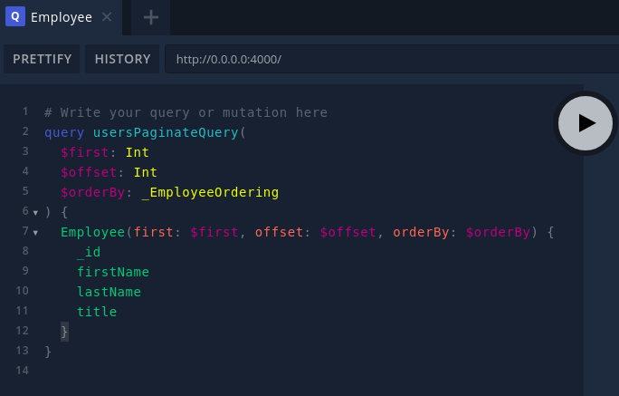

# GRAPHKS Starter - GraphQL API


## Quick Start

Install dependencies:

```
npm install
```

Start the GraphQL service:

```
npm start
```

This will start the GraphQL service (by default on localhost:4000) where you can issue GraphQL requests or access GraphQL Playground in the browser:



## Configure

